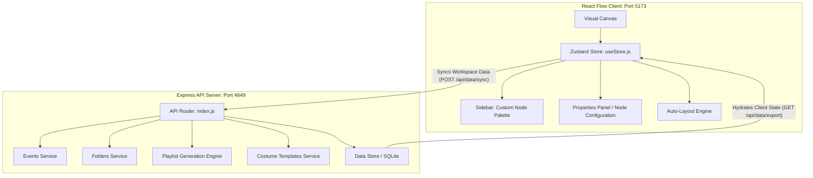

# Event Flow Writer

Event Flow Writer is an interactive visual event tree/flow designer for creating story chains and prompt playlists. It comprises a modern React Flow-based frontend and an Express.js-powered simulation/data-sync backend API.

---

## Features

* **Visual Canvas Editor**: Interactive tree modeling with customized nodes, drag-and-drop components, and canvas controls.
* **Edge Splicing & Extraction**: Automatic insertion of nodes dropped onto existing connections and dynamic **Ctrl+Drag** extraction.
* **Zustand History Store**: Action logging supporting full undo, redo, copy, paste, and duplicate mechanics.
* **Weighted Sim Engine**: Local API-supported narrative paths simulation calculating weights and state overrides on branches.

---

## System Architecture



---

## Directory Layout

* `src/` — React Flow editor frontend
  * `App.jsx` — Core application workspace layout and editor controller
  * `main.jsx` — Entrypoint and stylesheet registers
  * `components/` — React UI components (Sidebar, Properties Panel, Modals)
    * `nodes/` — Core Custom Node React implementations (e.g. `EventNode.jsx`, `BranchNode.jsx`)
  * `store/`
    * `useStore.js` — Zustand state store containing the canvas nodes/edges state, history, auto-layout algorithms, and data integration
* `server/` — Express.js simulation & storage API backend
  * `index.js` — Backend bootstrap, server configuration, route assignments, and middleware
  * `routes/` — Endpoint groups (events, folders, playlist generation, costumes)
  * `openapi.yaml` — Swagger API specification
* `shared/` — Common types and utility modules
* `docs/` — Schema adjustment designs, plan logs, and architecture documentation

---

## Custom Node Types

The visual editor registers several custom node types in the React Flow viewport, representing distinct narrative control elements:

| Node Type | Icon | Visual Module File | Role & Capabilities |
| :--- | :---: | :--- | :--- |
| **Start** | 🚀 | `src/components/nodes/StartNode.jsx` | Entry point for event flows; supports variable input bindings. |
| **Event** | 🎭 | `src/components/nodes/EventNode.jsx` | Represents a story beat or prompt with body text, conditions, and costumes. |
| **Branch** | 🔀 | `src/components/nodes/BranchNode.jsx` | Splits execution routes dynamically based on path weights and percentages. |
| **Reference** | 🔗 | `src/components/nodes/ReferenceNode.jsx` | Links to another sub-event flow, allowing modular composition. |
| **Group** | 📦 | `src/components/nodes/GroupNode.jsx` | Visually encloses/gathers nodes for structural organization. |
| **If / Conditional** | ❓ | `src/components/nodes/IfNode.jsx` | Evaluates criteria to route execution. |
| **Carry Forward** | 📥 | `src/components/nodes/CarryForwardNode.jsx` | Passes outputs and state overrides forward through the sequence. |
| **Field** | 📝 | `src/components/nodes/FieldNode.jsx` | Edits or declares custom template fields. |
| **End** | 🏁 | `src/components/nodes/EndNode.jsx` | Terminates flow execution. |

---

## API Endpoints

The backend Express application exposes the following routes for external integrations:

### Core Data & Sync
* **`GET /api/data/export`** — Fetches the full JSON dump of folders and event trees.
* **`POST /api/data/sync`** — Overwrites the persistent store with the active frontend state.
* **`GET /api/health`** — General system health and status check.

### Event & Simulation
* **`GET /api/events`** — Returns a list of all defined events.
* **`GET /api/events/:id`** — Fetches a single event configuration.
* **`POST /api/events/:id/simulate`** — Executes a simulation pass down the visual flow.
* **`POST /api/simulate/bulk`** — Runs simulation metrics across multiple trees.
* **`POST /api/playlist/generate`** — Combines and compiles paths into a finalized prompt playlist.

### Costume Customization
* **`GET /api/clothes`** — Fetches all registered costume templates.
* **`GET /api/clothes/:name`** — Gets properties of a single costume template.

---

## Getting Started

### Prerequisites
* **Node.js** (v18 or higher recommended)
* **npm** (comes packaged with Node.js)

### Installation
Run the dependency installation in the project directory:
```bash
npm install
```

### Running the Services

#### Option A: Single Command (Concurrent Developer Mode)
Run both backend Express server and Vite frontend compiler in parallel:
```bash
npm run dev:all
```
* Visual Editor Canvas runs at: `http://localhost:5173`
* Express API Server runs at: `http://localhost:4649`
* Interactive API Documentation runs at: `http://localhost:4649/api/docs/ui`

#### Option B: Standalone Runs
* To boot only the **Frontend client**:
  ```bash
  npm run dev
  ```
* To boot only the **Backend server**:
  ```bash
  npm run api
  ```
  *(Or double-click `start_backend.bat` on Windows systems)*
